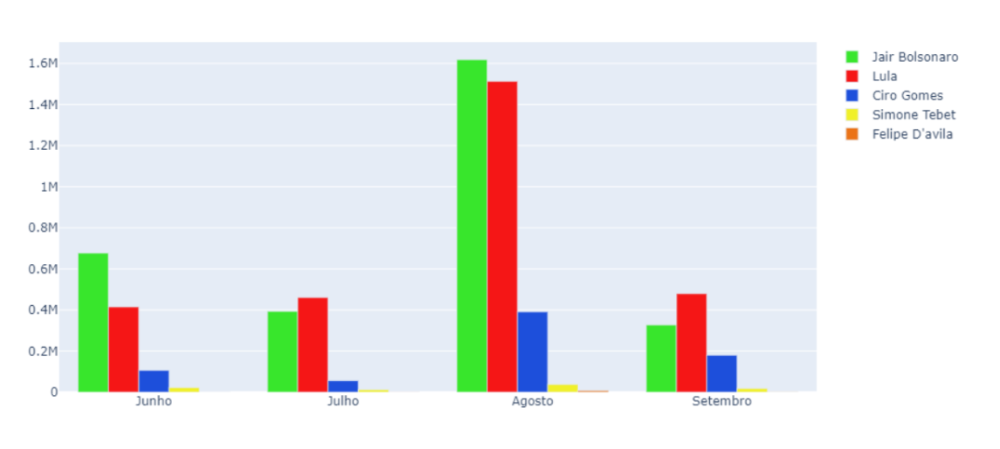
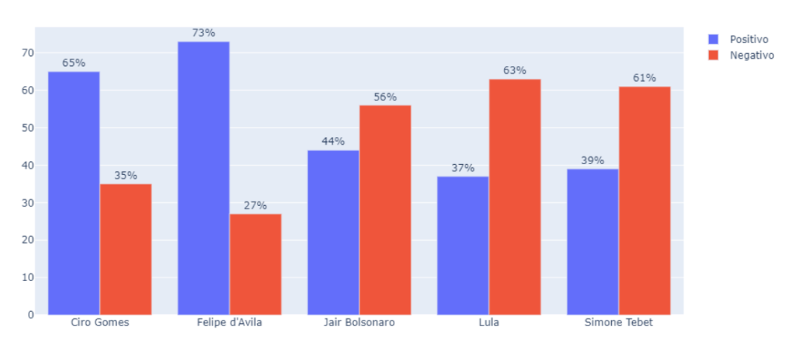

---
layout: post
title: Sentiment Analysis of the Brazilian Elections
subtitle: Analysis of sentiments expressed on Twitter in relation to the presidential election candidates of 2022
tags: [data-science, python]
author: Sarah Silva
--- 

# Objective
This project aims to analyze feelings expressed by Twitter users in relation to
candidates for the presidency of the 2022 election, with the aim of verifying whether the performance
of candidates in the presidential election is related to their popularity on social networks.

# Model construction

## Data Extraction

To collect data from the Twitter platform, the snscrape tool was used. It is
available as a Python library, which allows you to extract tweets from a specific period using key words.
On this study, the filtered locations were the capitals of the Brazilian states, as well as the capital of the 
country. The key-words used were the names of the candidates.

```python
import snscrape.modules.twitter as sntwitter
import pandas as pd
import itertools

dat_ini = '2022-10-01'
dat_fim = '2022-10-02'

def search_bolsonaro_sudeste(text = 'bolsonaro', start = dat_ini, end = dat_fim):
    tweets =[]
    for i, tweet in enumerate(sntwitter.TwitterSearchScraper(f'{text} since:{start} until:{end} near:"Belo Horizonte" lang:pt').get_items()):
        tweets.append([tweet.date, tweet.id, tweet.content, tweet.username])
    tweets_bolsonaro_bh = pd.DataFrame(tweets, columns = ['date', 'tweet id', 'content', 'username'])
    
    for i, tweet in enumerate(sntwitter.TwitterSearchScraper(f'{text} since:{start} until:{end} near:"São Paulo" lang:pt').get_items()):
        tweets.append([tweet.date, tweet.id, tweet.content, tweet.username])
    tweets_bolsonaro_sp = pd.DataFrame(tweets, columns = ['date', 'tweet id', 'content', 'username'])
    
    for i, tweet in enumerate(sntwitter.TwitterSearchScraper(f'{text} since:{start} until:{end} near:"Rio de Janeiro" lang:pt').get_items()):
        tweets.append([tweet.date, tweet.id, tweet.content, tweet.username])
    tweets_bolsonaro_rj = pd.DataFrame(tweets, columns = ['date', 'tweet id', 'content', 'username'])
    
    for i, tweet in enumerate(sntwitter.TwitterSearchScraper(f'{text} since:{start} until:{end} near:"Vitória" lang:pt').get_items()):
        tweets.append([tweet.date, tweet.id, tweet.content, tweet.username])
    tweets_bolsonaro_vt = pd.DataFrame(tweets, columns = ['date', 'tweet id', 'content', 'username'])
    
    df_final_bolsonaro_sudeste = pd.concat([tweets_bolsonaro_bh, tweets_bolsonaro_sp, tweets_bolsonaro_rj, tweets_bolsonaro_vt], ignore_index=True)
```

After each search, the tweets found were saved in a file containing the
publication date, id, text, user and region. At the end of the collection, each candidate listed
had an archive of tweets for each region of the country, therefore totaling five.

## Train database

In order to classify each text as positive, negative or neutral,
the Naive Bayes and SVM algorithms were used. As they are supervised models, it was
necessary to build a base of labeled tweets, in order to obtain the training database for the models.

| Sentiment | Number of tweets | 
| :------ |:--- | :--- |
| Positive | 320 |
| Neutral | 297 |
| Negative | 383 |
| Total | 1000 |

## Preprocessing

To clean the data, the following procedures were carried out:

- **Removal of special characters, hyperlinks, punctuation, markings
users and accents:** do not add value to the construction of the model;

```python
for i in range(len(Corpus['content'])):
    palavras = Corpus['content'][i].split()
    palavras = [x for x in palavras if "@" not in x]
    palavras = [x for x in palavras if "kk" not in x]
    entry = ' '.join(palavras)
    Corpus['content'][i] = entry

Corpus['content'] = Corpus['content'].apply(lambda x: re.sub('[0-9]|,|\.|/|$|\(|\)|-|\+|:|•', ' ', x))

Corpus['content'] = [re.sub(r'^rt[\s]+', '', entry) for entry in Corpus['content']]
    
Corpus['content'] = [re.sub(r'https?:\/\/.*[\r\n]*http', '', entry) for entry in Corpus['content']]
Corpus['content'] = [re.sub(r'https', '', entry) for entry in Corpus['content']]
Corpus['content'] = [re.sub(r'http', '', entry) for entry in Corpus['content']]

Corpus['content'] = [re.sub(r'\n', '', entry) for entry in Corpus['content']]
```

- Removal of the word used in the search;
- Word correction: incorrectly written words and slang words were corrected;
- Standardization of text in lowercase letters.

```python
Corpus['content'] = [entry.lower() for entry in Corpus['content']]
```

- Tokenization: extraction of minimum text units from tweets;

```python
Corpus['content']= [word_tokenize(entry) for entry in Corpus['content']]
```

- Stopwords removal: use of Python's NLTK library to remove
words that are considered irrelevant. A list was created
with additional words to complete the library;
- Lemmatization: reduction of words to their root, removing the inflections present.

```python
tag_map = defaultdict(lambda : wn.NOUN)
tag_map['J'] = wn.ADJ
tag_map['V'] = wn.VERB
tag_map['R'] = wn.ADV
for index,entry in enumerate(Corpus['content']):
    Final_words = []
    for word, tag in pos_tag(entry):
        if word not in stopwords and word.isalpha():
            if word in correcao:
                word = correcao[word]
            word = unidecode(word)
            word_Final = [token.lemma_ for token in nlp(word)]
            Final_words.extend(word_Final)
    Corpus.loc[index,'text_final'] = str(Final_words)
```

## Model construction

Initially, 2 classifiers were tested: Naive Bayes and
SVM. They were chosen because they are some of the most used models. It's important to highlight
that they both were built in the Python programming language, using
the **sklearn library**.

It is important to highlight that for the construction of this experiment, the database was balanced using undersampling, a technique that consists of reducing instances of the majority classes.

```python
# Classificador Naive Bayes
Naive = naive_bayes.MultinomialNB()
Naive.fit(Train_X_Tfidf,Train_Y)
predictions_NBTest = Naive.predict(Test_X_TfidfLula)
Test_YRecover = Encoder.inverse_transform(predictions_NBTest)
df_lula['previsao_NB'] = Test_YRecover

# Classificador SVM
SVM = svm.SVC(C=1.0, kernel='linear', degree=3, gamma='auto')
SVM.fit(Train_X_Tfidf,Train_Y)
predictions = SVM.predict(Test_X_TfidfLula)
predictions_recovered = Encoder.inverse_transform(predictions)
df_lula['previsao_SVM'] = predictions_recovered
```

## Classifiers evaluation

To evaluate the result generated by the classifier, it is necessary to apply
evaluation tricks. In data mining, evaluation is carried out using metrics
such as accuracy, precision, recall, f-measure, among others. On this project, I chose to
use accuracy, precision and recall as a parameter for evaluating models.

```python
print("-------------- SVM ----------------")
print("SVM Accuracy: ",accuracy_score(predictions_SVM, Test_Y)*100)
print("SVM F-Measure: ",f1_score(predictions_SVM, Test_Y, average="macro")*100)
print("SVM Precision: ",precision_score(predictions_SVM, Test_Y, average="macro")*100)
print("SVM Recall: ",recall_score(predictions_SVM, Test_Y, average="macro")*100)

print("----------- Naive Bayes -----------")
print("Naive Bayes Accuracy: ",accuracy_score(predictions_NB,Test_Y)*100)
print("Naive Bayes F-Measure: ",f1_score(predictions_NB, Test_Y, average="macro")*100)
print("Naive Bayes Precision: ",precision_score(predictions_NB, Test_Y, average="macro")*100)
print("Naive Bayes Recall: ",recall_score(predictions_NB, Test_Y, average="macro")*100)
```

# Results

The data extraction was carried out on the social network Twitter using the key words for each candidate. 
The initial date of collection was 01/06/2022, and the end 01/10/2022, 1 day before the 1st round of election. In total, I collected
6,778,481 tweets. The graphic below represents the number of tweets collected each month by candidate.



## Classifiers evaluation

The table below shows the confusion matrix obtained for the model built with the
SVM classifier. It is possible to see that the main flaw of the model was the recognition of neutral classes as negative. However, overall the classifier obtained 52% of accuracy.

|               | Classified as Positive    | Classified as Neutral | Classified as Negative    |  Total    | 
| :------       |:---                       | :---                  | :---                      | :---      |
| Real Positive | 131 (44%)                 | 76 (26%)              | 90 (30%)                  | 297       |
| Real Neutral  | 44 (14%)                  | 126 (43%)             | 126 (43%)                 | 296       |
| Real Negative | 29 (10%)                  | 71 (24%)              | 197 (66%)                 | 297       |
| Total         | 204                       | 273                   | 413                       | 890       |

The next table shows the confusion matrix obtained for the model constructed
with the Naive Bayes classifier. In this case, it is possible to see that the model built
had difficulty learning neutral classes, as he was unable to predict most of the
instances of this class correctly. For this reason, the model predicted 50% of total instances
correctly.

|               | Classified as Positive    | Classified as Neutral | Classified as Negative    |  Total    | 
| :------       |:---                       | :---                  | :---                      | :---      |
| Real Positive | 192 (65%)                 | 55 (19%)              | 50 (16%)                  | 297       |
| Real Neutral  | 112 (38%)                 | 92 (31%)              | 92 (31%)                  | 296       |
| Real Negative | 90 (30%)                  | 46 (15%)              | 161 (55%)                 | 297       |
| Total         | 394                       | 193                   | 303                       | 890       |

In addition to the confusion matrix, the accuracy, precision and recall measures of each classifier were evaluated, with the results described on the next table.

|  | Naive Bayes | SVM |
| :------ |:--- | :--- |
| Accuracy | 50% | 52% |
| Precision | 51% | 54% |
| Recall | 50% | 51% |

Therefore, after analyzing all of the models and their results, I decided to use the SVM.

## Results obtained with the SVM classification

After choosing and training the classifier, it was possible to classify the entire database
of each candidate, and thus analyze the popularity of each one on Twitter. It is important to highlight that for candidate approval analyses, tweets classified as neutral were removed, as they do not add to the distinction of what is support or
rejection of candidates.

The graphic below shows the overview of the classification. It is possible to see the prominence that candidates Ciro Gomes and Felipe d’Avila had on social networks, obtaining the highest approval rates of the candidates analyzed. On the other hand, Simone Tebet, Jair Bolsonaro and Lula had the lowest approval rates respectively.



But, as shown on the next graphic, the result of the election vs the predicted on this project shows some differences.


Based on the experiment carried out, it was possible to conclude that there were no similarities between the candidate's popularity rate on the social network Twitter and their performance on the presidential election, with the exception of candidate Jair Bolsonaro's approval rate, as it was very close to its real percentage of votes. However, the two most commented candidates on Twitter were those who managed to advance to the second round.

A possible explanation for this, is the great difference on the size of the data collected between the candidates. Candidate Felipe d’Avila, for example, despite having been the best evaluated, obtained 9,772 tweets collected, which represents only 0.001% of the total tweets
collected. This could mean that despite being well evaluated by his audience, Felipe d’Avila is not well known by most Brazilians, directly impacting its performance in the election.
