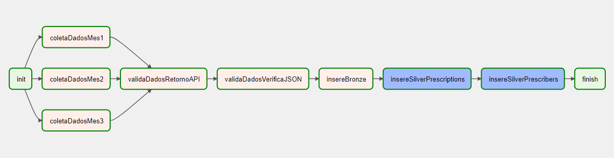

The main object of this project was to collect data from an API, store it on a database so that we could perfom a couple of queries on them.
To solve this issue, the following architecture was implemented: 

