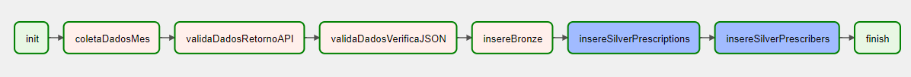

The main object of this project was to collect data from an API, store it on a database so that we could perfom a couple of queries on them.

To solve this issue, the following architecture was implemented initially: 

### Data extraction

- The data extraction stages were initially build to extract data from the last 3 months of prescription;
- Each DAG provides 1 month of extraction;
- The code used was built in **Python** using the **PythonOperator** task, and has a limitation of 100 data per request;

### Data validation

- The first validation performed is if the collection was successful (data is not returning as None due to some failure in the API);
- The second is if they are in the correct format and consequently can be transformed into JSON;
- The code used was also built in **Python**, using Airflow's **PythonOperator** task.

### Data persistency

- The tool chosen to store the data was **BigQuery**, as it is one of the main GCP tools used when we want to build Data Lakes. Furthermore, as Cloud Composer was used to build Airflow, the integration with BigQuery is easier;
- Initially, the raw data is inserted into the **Bronze processing layer**, through Python code also using Airflow's PythonOperator task;
- Later the data is processed, separating it into prescribers and prescriptions, and stored on the **silver processing layer**;
- To insert prescriptions, *data is only entered if it is new*, that is, collected in the last month. This step is done through Airflow's BigQueryOperator task;
- To insert prescribers, *it is checked whether those collected in the last month already exist in the table*. If not, they are inserted, if yes, they are not inserted. This step is done through the Airflow BigQueryInsertJobOperator task.

Shortly after the initial data collection, the pipeline was modified to the following structure, which runs automatically on the 1st of each month at 8am:

The only modification made was in relation to data collection. Instead of always collecting the last 3 months, it only collects the last month. The entire validation and persistence process remains the same.