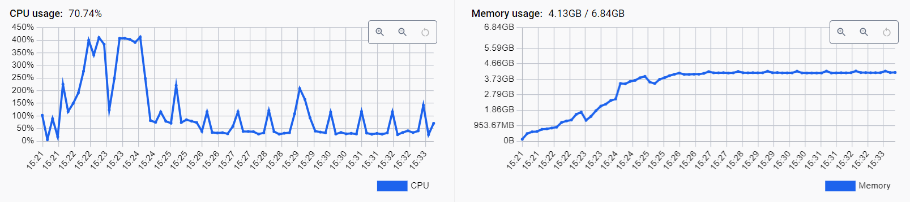
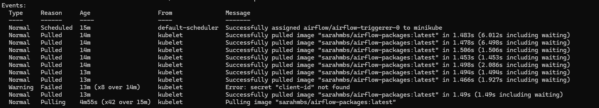

---
layout: post
title: ETL process with Spotify API
subtitle: Using the spotify API to build an ETL process with Airflow, Kubernetes and MySQL
tags: [mysq, etl, api, airflow, kubernetes]
author: Sarah Silva
--- 

[IN PROGESS]

# Objective

The main goal with this project is to collect personal data on Spotify - top tracks, favorite artists, playlists - clean it, and add to a local MySQL database for further analysis. The process needs to be executed each week, updating the new favorite artists and songs (in case there are new ones).

In order to achieve this goal, I decided to deploy an instance of Airflow on Minikube, using the Helm package.

# Preparing the environment 

## Minikube
First of all, I installed an instance of Minikube, with the Docker container.

In order to work with k8s, I also installed kubctx and kubens as well, through a tool called **Chocolatey**.
- **kubectx** is a tool to switch between contexts (clusters) on kubectl faster;
- **kubens** is a tool to switch between Kubernetes namespaces (and configure them for kubectl) easily.

```powershell
choco install kubectlx
choco install kubens
```

## Chocolatey
Chocolatey aims to automate the entire software lifecycle from install through upgrade and removal on Windows operating systems.

**How to install**
> 1. Open Windows Powershell as an administrator
> 2. Type the command: Set-ExecutionPolicy Bypass -Scope Process -Force; [System.Net.ServicePointManager]::SecurityProtocol = [System.Net.ServicePointManager]::SecurityProtocol -bor 3072; iex ((New-Object System.Net.WebClient).DownloadString('https://community.chocolatey.org/install.ps1'))

## Helm package

Helm helps you manage Kubernetes applications — Helm Charts help you define, install, and upgrade even the most complex Kubernetes application. This is exactly why I chose to download the Airflow on k8s using the package provided by Helm. To install it, I also used chocolatey:

```powershell
choco install kubernetes-helm
```

## Configuring the helm package

After starting my k8s cluster with the command:

```powershell
minikube start
```
I added airflow to my Helm packages:

```powershell
helm repo add apache-airflow https://airflow.apache.org/
```

By default, airflow points directly to its own DAGs repository. So, we need to copy the helm package to our local machine, instead of just downloading it directly to the cluster. This way, we can change all of the standard configurations to our necessities. This is done by changing the file values.yaml.

```powershell
helm pull apache-airflow/airflow
tar zxvf airflow-1.11.0.tgz
```

So, everytime we install helm, it points to a file called values.yaml. On the case of the airflow, at the end of the file on the part of **gitSync**, it points directly to the git file of the own airflow. We need to alter that part, so that we can create our own DAGs.

```yaml
gitSync:
    enabled: true
    # changed this link to my own repository
    repo: https://github.com/sarahmbss/api-spotify-elt.git
    branch: main
    rev: HEAD
    depth: 1
```

As my git repository is public, I just changed the default one for mine. If I had a private one, I would have to create a file named encoding with git's name and token, and update yaml with the following command:

```powershell
kubectl apply -f git-secret.yaml -n airflow
```

After changing the first configurations, I installed the airflow helm package on my k8s cluster:

```powershell
helm install airflow airflow -n airflow --create-namespace
```

## Monitor and access the cluster

To monitor the pods on my namespace, I used k9s:

```powershell
k9s -n airflow
```

This allowed me to check how many restarts each pod had, as well as their log file.

After checking if all my pods were ok, I accessed the Airflow page:

```powershell
kubens airflow
kubectl port-forward svc/airflow-webserver 8080:8080
```

## Installing extra packages

After the initial tests, I had to install extra packages (like the Spotify package) on Airflow. The recommended process, according to the [helm documentation](https://airflow.apache.org/docs/docker-stack/build.html), is to add an image on Docker, with the following Dockerfile:

```Dockerfile
FROM apache/airflow:2.8.1
COPY requirements.txt .
RUN pip install --no-cache-dir "apache-airflow==${AIRFLOW_VERSION}" -r requirements.txt
```

On requirements.txt, I added all of the packages I needed to run my DAGs sucessfully. After I pushed the image I created to Docker Hub, I had to alter values.yaml. The standard values.yaml comes with the default Airflow image. If we want to use our own image, we need to replace it with our repository and tag:

```yaml
images:
  airflow:
    repository: sarahmbs/airflow-packages
    tag: latest
    pullPolicy: Always
```

After that, I upgraded my namespace with the following command:

```powershell
helm upgrade airflow airflow --namespace airflow --values values.yaml
```

## Adding secret variables to cluster

In case you want to store sensitive information like I did, such as database username and password, you can use Kubernetes Secret:

```powershell
kubectl create secret generic client-id --from-literal=CLIENT_ID=xxxxxx -namespace airflow
```

After that, add this information to values.yaml

```yaml
# Secrets for all airflow containers
secret: 
  - envName: "CLIENT_ID_ENV"
   secretName: "client-id"
   secretKey: "CLIENT_ID"
```

# Problems I faced

## pendulum version

The first tests I did was with Airflow 2.7.1. On this version, whenever I tried installing extra packages with the Dockerfile I created, the following error kept happening:

*pendulum.tz.timezone("UTC") TypeError: 'module' object is not callable*

After some research, I figured out that it was an Airflow version issue, that was solved on 2.8.1. So I had to change my Dockerfile from 2.7.1 to 2.8.1 in order to update the Airflow.

## memory allocation

After I uploaded my first real DAG, whenever the website worker was initiallizing, it kept getting this error:

*Received signal: 15. Closing gunicorn*

After concluding that it might have been a memory issue, I had to increase both memory and CPU for my minikube cluster. The default value was 2GB for memory and 2CPUs. With the following command, I increased it to 7GB and 4CPUs and then the problem was solved and I was able to access again the webserver normally.

```powershell
minikube stop
minikube delete
minikube start --memory 7000 --cpus 4
```



## Debugging each pod

Sometimes, an error would occur in some specific pods. In order to understand what was happening, I used this command:

```powershell
kubectl describe -n airflow pod airflow-triggerer-0
```

It generates a detailed information of the pod and the list of events that happened during its creation. It can be very usefull when debugging values.yaml.

