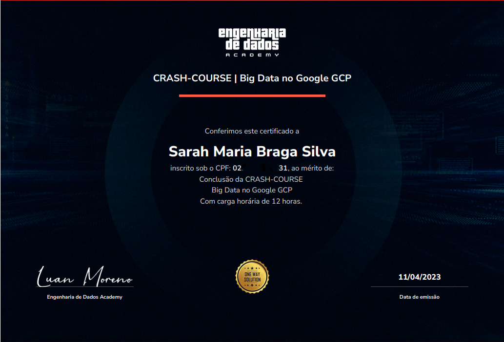
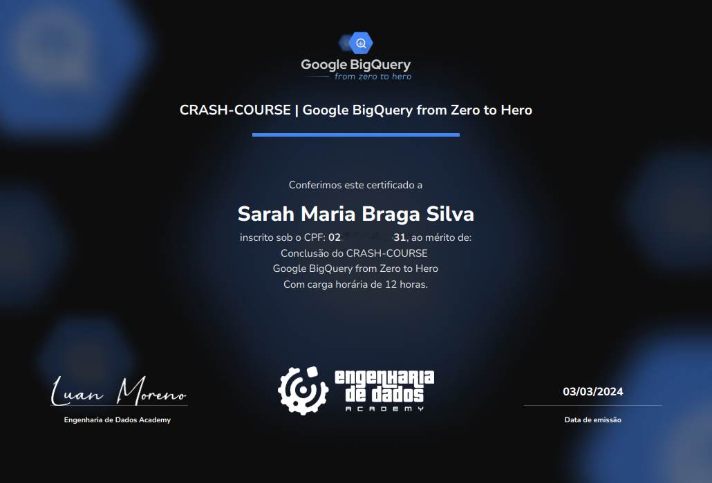
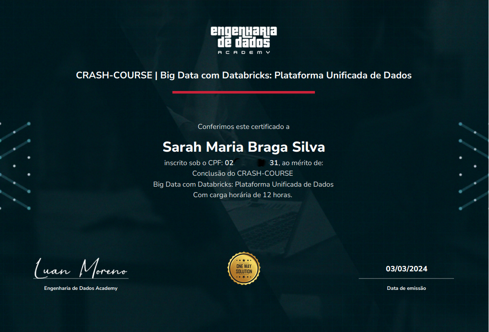
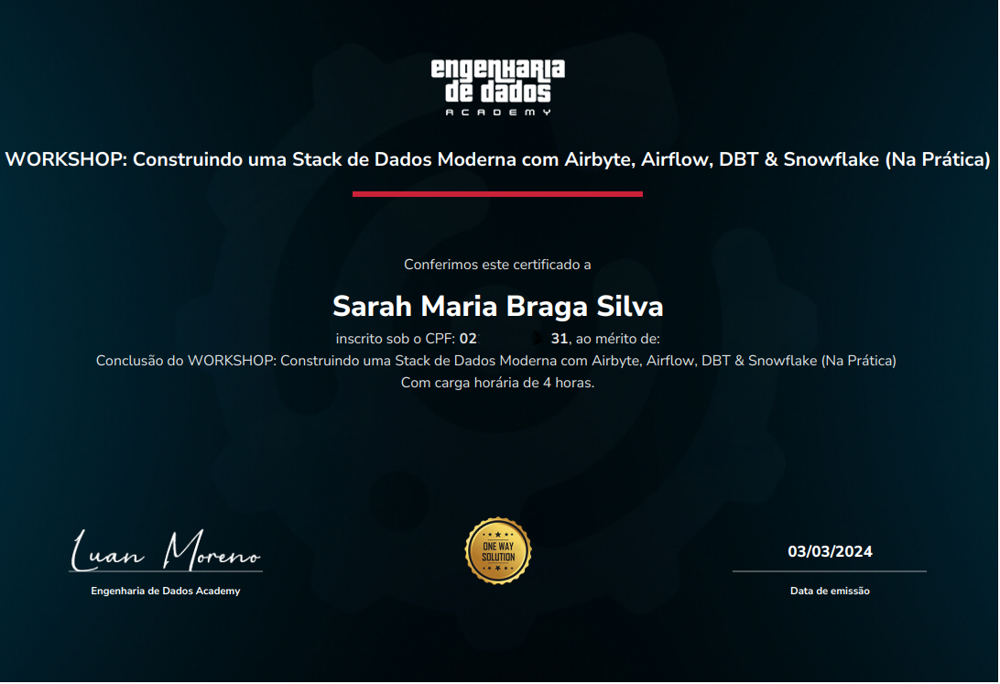
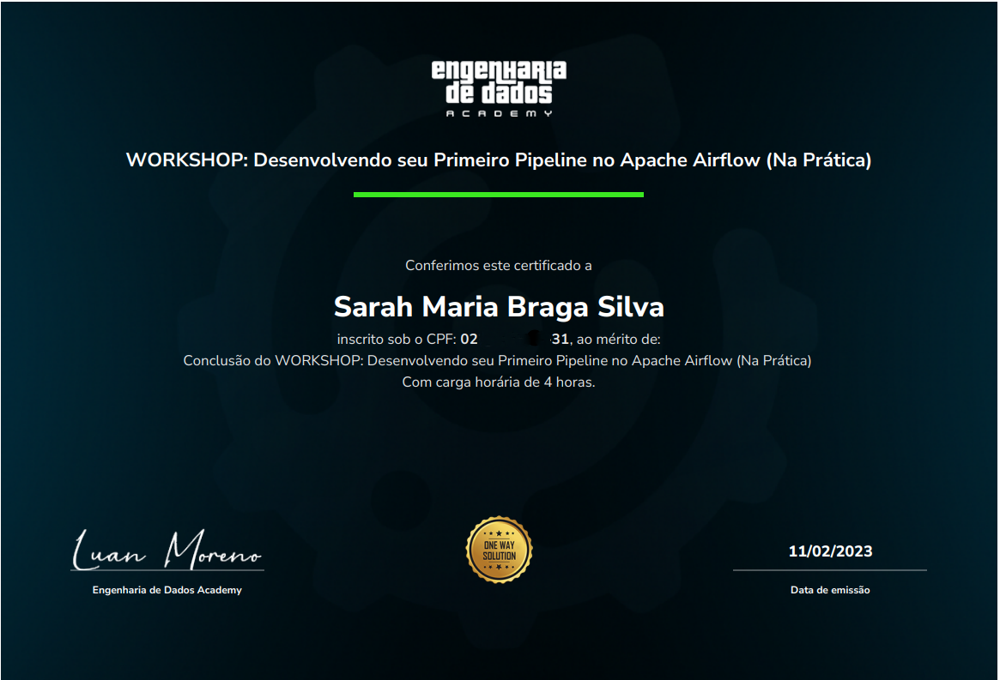
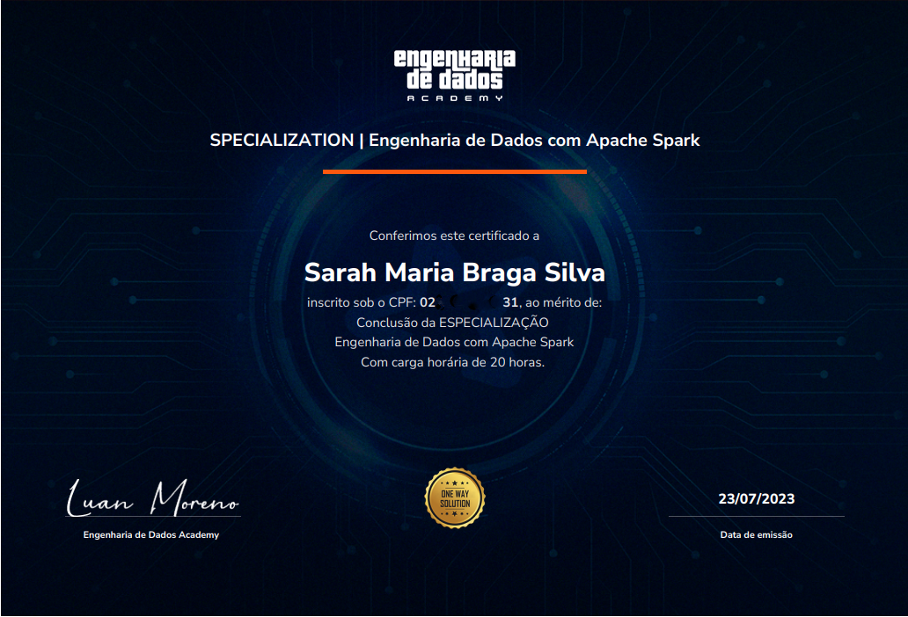
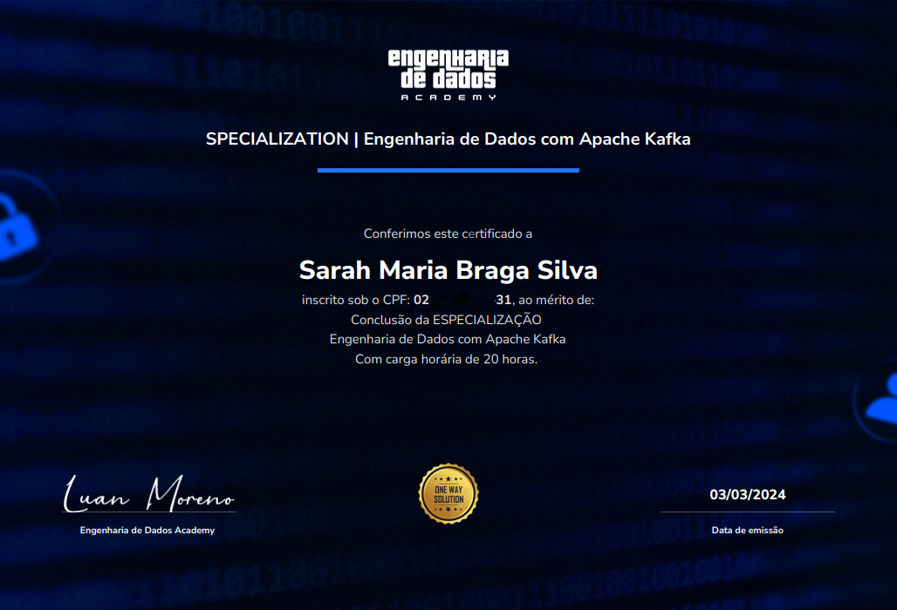

CRASH-COURSE - Big Data on GCP

**Organization:** Engenharia de Dados Academy

CRASH-COURSE - Google BigQuery from Zero to Hero

**Organization:** Engenharia de Dados Academy

CRASH-COURSE - Big Data with Databricks: Unified Data Platform

**Organization:** Engenharia de Dados Academy

WORKSHOP: Building a Data Lakehouse with Delta Lake and Iceberg, using Apache Spark

**Organization:** Engenharia de Dados Academy

WORKSHOP: Building a Modern Data Stack with Airbyte, Airflow, DBT & Snowflake

**Organization:** Engenharia de Dados Academy

WORKSHOP: Developing your First Pipeline on Apache Airflow

**Organization:** Engenharia de Dados Academy

SPECIALIZATION - Data Engineering with Apache Spark

**Organization:** Engenharia de Dados Academy

SPECIALIZATION - Data Engineering with Apache Kafka

**Organization:** Engenharia de Dados Academy

